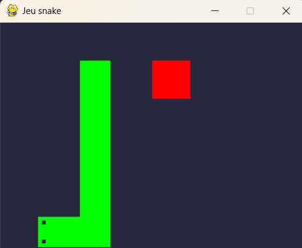
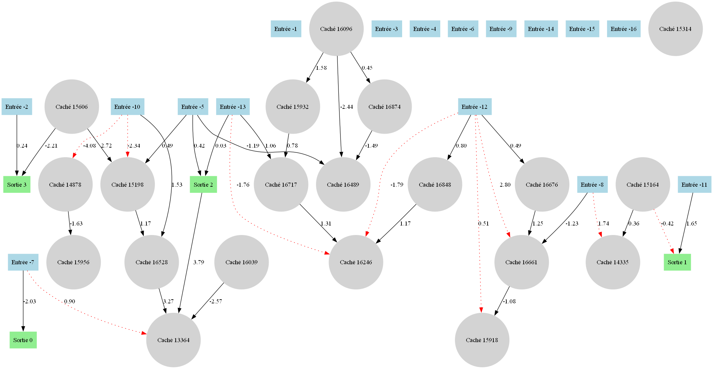

# 🐍 Snake AI Using NEAT (NeuroEvolution)
This project features an AI that learns to play Snake autonomously using the NEAT (NeuroEvolution of Augmenting Topologies) algorithm. No hardcoded strategies — the agent improves over generations through genetic mutations and natural selection. 🧬🤖

# 🧠 What It Does
  🕹️ The AI controls a snake in a classic grid-based Snake game.

  🧬 It evolves over time using NEAT: networks mutate, reproduce, and get selected based on performance (fitness).

  👁️ Visual interface shows the best snake live as it learns.

# 🚀 Features
  🔄 No supervised learning – only evolution by fitness

  🧠 Networks evolve topologies and weights

  📊 Real-time simulation with visualization

  🏆 Tracks best fitness, average scores, and generation progress

Here is an image of what it looks like :

# 📦 Dependencies
  Python 3.x 🐍
  neat-python
  pygame for visualization 🎮

# 📝 Notes
⏳ Training takes time – early generations play poorly but evolve quickly. I train it approximately 15h and the best score is 13 apples. Here is the best neural network :

🧪 You can adjust mutation rates, population size, and other parameters in the NEAT config file.
