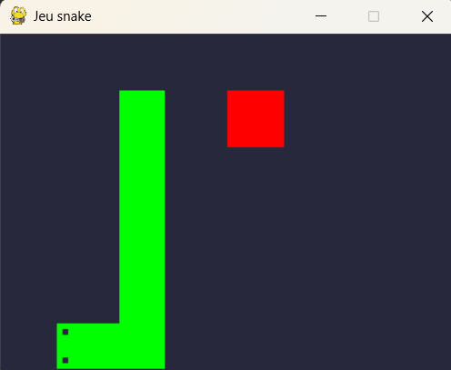

# 🐍 Snake AI Using NEAT (NeuroEvolution)


  

  
  

## 📝 Project Description 
This project features an AI that learns to play [My Snake game](https://github.com/Thibault-GAREL/snake_game) autonomously using the NEAT (NeuroEvolution of Augmenting Topologies) algorithm. No hardcoded strategies — the agent improves over generations through genetic mutations and natural selection. 🧬🤖

---

## 🚀 Features
  🔄 No supervised learning – only evolution by fitness

  🧠 Networks evolve topologies and weights

  📊 Real-time simulation with visualization

  🏆 Tracks best fitness, average scores, and generation progress in a Excel


## Example Outputs
Here is an image of what it looks like :

<p align="center">
  
</p>

---

## ⚙️ How it works

  🕹️ The AI controls a snake in my classic grid-based [Snake game](https://github.com/Thibault-GAREL/snake_game).

  🧬 It evolves over time using NEAT: networks mutate, reproduce, and get selected based on performance (fitness).

  👁️ Visual interface shows the best snake live as it learns.

  📈 An Excel is here to track the score or the loss.

## 🗺️ Schema
⏳ Training takes time – early generations play poorly but evolve quickly. I train it approximately 15h and the best score is more than 20 apples. It can also **adapt** to different area. Here is the best neural network :


🧪 You can adjust mutation rates, population size, and other parameters in the NEAT config file.

---

## 📂 Repository structure  
```bash
├── Images/                 # Images for the README
│
├── best_model_8.pkl        # Saved model checkpoint
├── best_model_11.pkl       # Saved model checkpoint - the best
│
├── compteur.py             # Counter script
├── compteur_executions.txt # Execution log for the counter
├── config.txt              # Neat configuration file
├── donnees_neat.xlsx       # Training data (Excel) - Graph for score
│
├── exw.py                  # Excel writer script
├── ia.py                   # Main AI logic
├── main.py                 # Project entry point
├── network_graph/          # Network graph visualization
│   └── network_graph.png
├── snake.py                # Snake game implementation
│
├── LICENSE                 # Project license
├── README.md               # Main documentation
```

---

## 💻 Run it on Your PC  
Clone the repository and install dependencies:  
```bash
git clone https://github.com/Thibault-GAREL/snake_game.git
cd snake_game

python -m venv .venv #if you don't have a virtual environnement
source .venv/bin/activate   # Linux / macOS
.venv\Scripts\activate      # Windows

pip install neat-python numpy pygame openpyxl

python main.py
```
---

## 📖 Inspiration / Sources  
I code it without any help 😆 !

Code created by me 😎, Thibault GAREL - [Github](https://github.com/Thibault-GAREL)