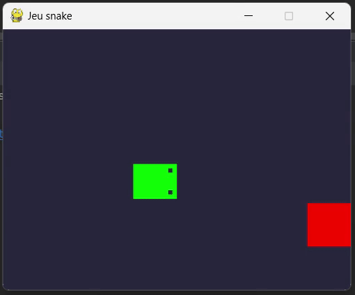
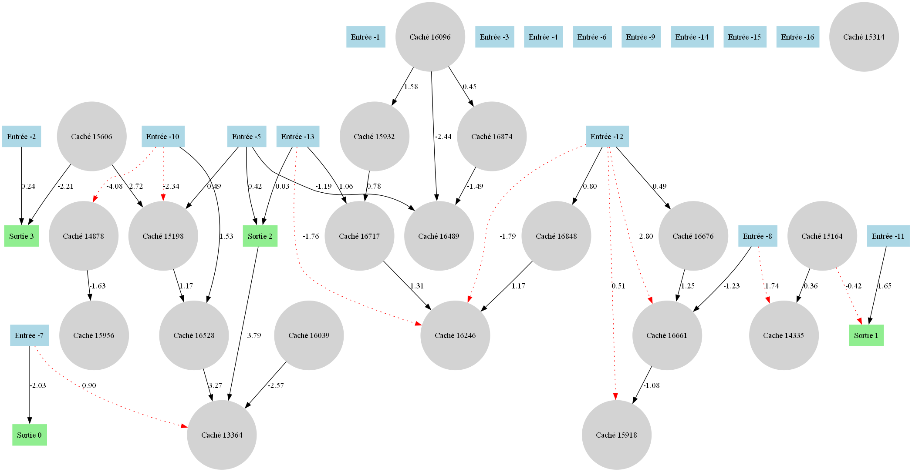
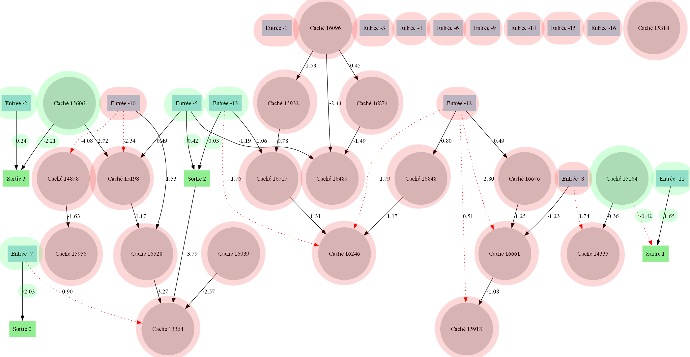
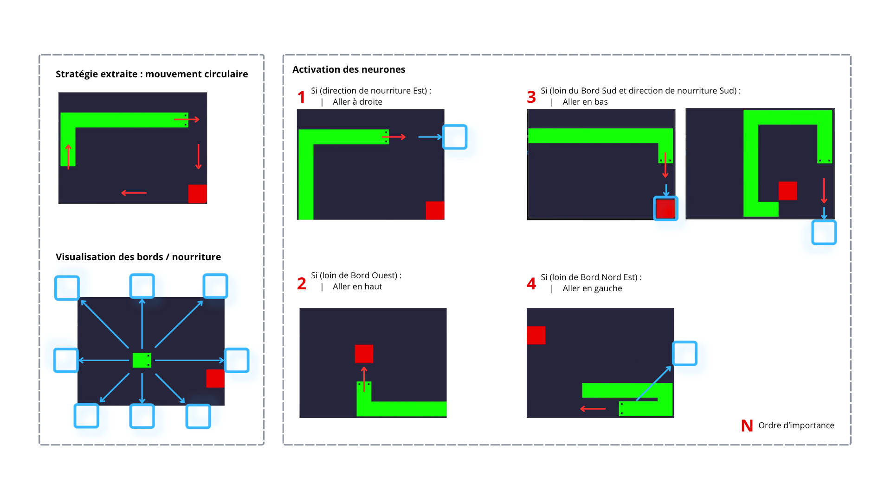

# 🐍 Snake AI Using NEAT (NeuroEvolution)


<p align="center">
  
</p>

## 📝 Project Description
This project features an AI that learns to play [My Snake game](https://github.com/Thibault-GAREL/snake_game) autonomously using the NEAT (NeuroEvolution of Augmenting Topologies) algorithm. No hardcoded strategies — the agent improves over generations through genetic mutations and natural selection. 🧬🤖

---

## 🎯 Context & Motivation

Neural networks make decisions without being able to explain them — the **black box problem**. This project explores **Explainable AI (XAI)**: extracting interpretable strategies from a trained agent, using Snake as a simple, visual testbed. NEAT's compact topology makes it uniquely suited for this: small enough to inspect manually, yet powerful enough to develop a real strategy.

---

## 🚀 Features

  🧠 Networks evolve topologies and weights

  📊 Real-time simulation with visualization

---

## ⚙️ How it works

  🕹️ The AI controls a snake in my classic grid-based [Snake game](https://github.com/Thibault-GAREL/snake_game).

  🧬 It evolves over time using NEAT: networks mutate, reproduce, and get selected based on performance (fitness).

  👁️ Visual interface shows the best snake live as it learns.

  📈 An Excel is here to track the score or the loss.

---

## 🗺️ Network Architecture
⏳ Training takes time – early generations play poorly but evolve quickly. I train it approximately 15h and the best score is more than 20 apples. It can also **adapt** to different area. Here is the best neural network :



🧪 You can adjust mutation rates, population size, and other parameters in the NEAT config file.

<details>
<summary>📸 See the neural network analysis</summary>

### For the input :
#### Distance to walls (8 inputs)

1. **distance_bord_n** — Distance to the wall to the North
2. **distance_bord_n_e** — Distance to the wall to the North-East
3. **distance_bord_e** — Distance to the wall to the East
4. **distance_bord_s_e** — Distance to the wall to the South-East
5. **distance_bord_s** — Distance to the wall to the South
6. **distance_bord_s_w** — Distance to the wall to the South-West
7. **distance_bord_w** — Distance to the wall to the West
8. **distance_bord_n_w** — Distance to the wall to the North-West

#### Distance to food (8 inputs)

9. **distance_food_n —** Distance to the food to the North
10. **distance_food_n_e** — Distance to the food to the North-East
11. **distance_food_e** — Distance to the food to the East
12. **distance_food_s_e** — Distance to the food to the South-East
13. **distance_food_s** — Distance to the food to the South
14. **distance_food_s_w** — Distance to the food to the South-West
15. **distance_food_w** — Distance to the food to the West
16. **distance_food_n_w** — Distance to the food to the North-West

### For the output:
| # | Raw |
|---|-----|
| 0 | `UP` |
| 1 | `RIGHT` |
| 2 | `DOWN` |
| 3 | `LEFT` |

<!--  -->

</details>

---

<details>
<summary>🟩 Interpretability spectrum — white / grey / black box</summary>

| Box type | Definition | Example here |
| --- | --- | --- |
| ⬜ White box | Fully readable logic | Q-table (policy readable by construction) |
| 🔲 Grey box | Transparent structure, unreadable complexity | XGBoost (80k–200k decision nodes) |
| ⬛ Black box | Opaque internals | DQL, PPO |
| 🟩 NEAT | Small enough for manual inspection + XAI | **This repo** |

NEAT sits in a unique position: its evolved topology stays compact enough to be read directly, making it the ideal entry point before applying automated XAI tools.

</details>

---

## 🔍 Manual Interpretability

The network below shows only the connections that actually matter after removing unused ones:


From this simplified view, the following strategy can be extracted manually:



---

## ⚙️ Key Hyperparameters

| Parameter | Value | Description |
|-----------|-------|-------------|
| `pop_size` | 100 | Population size (genomes per generation) |
| `fitness_threshold` | 30 | Target fitness score to stop training |
| `num_inputs` | 16 | Network inputs (8 wall + 8 food distances) |
| `num_hidden` | 8 | Initial hidden nodes (topology evolves via mutations) |
| `num_outputs` | 4 | Network outputs (UP, RIGHT, DOWN, LEFT) |
| `conn_add_prob` | 0.5 | Probability to add a connection per mutation |
| `node_add_prob` | 0.2 | Probability to add a node per mutation |
| `weight_mutate_rate` | 0.8 | Probability to mutate a connection weight |
| `survival_threshold` | 0.2 | Top 20% of species members survive to reproduce |
| `compatibility_threshold` | 3.0 | Speciation distance threshold |

---

## 🆚 Comparison — 4 Snake AI approaches

This project is part of a series of **4 Snake AI implementations** using different AI paradigms on the same game :

| Aspect | 🧬 [NEAT](https://github.com/Thibault-GAREL/AI_snake_genetic_version) ★ | 🌳 [Decision Tree](https://github.com/Thibault-GAREL/AI_snake_decision_tree_version) | 🤖 [DQL (DQN)](https://github.com/Thibault-GAREL/AI_snake_DQN_version) | 🎯 [PPO](https://github.com/Thibault-GAREL/AI_snake_PPO_version) |
| --- | --- | --- | --- | --- |
| **Paradigm** | Evolutionary | Imitation Learning | Reinforcement Learning | Reinforcement Learning |
| **Algorithm type** | Neuroevolution | Supervised (XGBoost + DAgger) | Off-policy (Q-learning) | On-policy (Actor-Critic) |
| **Architecture** | 16 → ~28 hidden (final, evolved) → 4 | 26 → 1 600 trees (400×4) → 4 | 28 → 256 → 256 → 128 → 4 | 28 → 256 → 256 → {128→4 (π), 128→1 (V)} |
| **Model complexity** | ~200–500 params (evolves) | ~80k–200k decision nodes | ~140k params | ~145k params |
| **Exploration** | Genetic mutations + speciation | DAgger oracle (β : 0.8 → 0.05) | ε-greedy (1.0 → 0.01) | Entropy bonus (coef 0.05) |
| **Memory / Buffer** | Population (100 genomes) | Supervised buffer (300 000) | Experience Replay (100 000) | Rollout buffer (2 048 steps) |
| **Batch** | — (full population eval.) | Full dataset per round | 128 | 64 |
| **Training time** | **~15 h** | **~12 min (GPU)** | **~2.5 h (GPU)** | **~3 h (GPU)** |
| **Max score** | **> 20** | **43** | **45** | **64** |
| **Mean score** | **10** | **22.77** | **22.60** | **38.67** |
| **GPU support** | ❌ | ✅ | ✅ | ✅ |
| **Sample efficiency** | 🔴 Low | 🟢 High | 🟡 Medium | 🔴 Low |
| **Generalization** | 🟡 Medium | 🔴 Low | 🟡 Medium | 🟢 High |
| **Intrinsic interpretability** | 🟡 Low | 🟡 Medium (ensemble = grey box) | 🔴 Black box | 🔴 Black box |

> ★ = current repository
> Each project includes an XAI suite of 4 analysis scripts.

<details>
<summary>📅 Development timeline — Gantt chart</summary>


</details>

---

## 🔬 XAI Suite

Four dedicated scripts analyze the evolved NEAT network :

| Script | Analysis | Output |
|--------|----------|--------|
| `xai_neat_outputs.py` | Output probability heatmaps, confidence map, temporal evolution | `xai_neat_outputs/` |
| `xai_neat_features.py` | Feature importance, weight analysis, feature-action correlation | `xai_neat_features/` |
| `xai_neat_activations.py` | Node activations, specialization per game situation | `xai_neat_activations/` |
| `xai_neat_shap.py` | SHAP analysis — beeswarm, waterfall, force plots | `xai_neat_shap/` |

---

## 📊 XAI Results — NEAT

> Key findings from the 4 XAI scripts applied to the best evolved network.

**Feature importance** (permutation importance + SHAP agree):

- Top features: `food_N` > `food_NE` > `wall_S` > `wall_SW`
- Food distances matter **more** than wall distances overall

**Hidden layer insight:**

- One hidden node stays saturated at tanh ≈ +1 across **100% of steps** — it behaves as a learned bias, not a situational sensor

**Learned policy:**

- Binary and circular: the agent switches between 2 dominant directions per food collect
- Explains ~10 apples average — consistent but limited

**Limits of NEAT:**

- No self-collision awareness — body is not part of the strategy
- Network too small for medium-term planning (score plateaus ~20)

---

## 📂 Repository structure
```bash
├── Images/                 # Images for the README
│
├── best_model_8.pkl        # Saved model checkpoint
├── best_model_11.pkl       # Saved model checkpoint - the best
│
├── compteur.py             # Counter script
├── compteur_executions.txt # Execution log for the counter
├── config.txt              # Neat configuration file
├── donnees_neat.xlsx       # Training data (Excel) - Graph for score
│
├── exw.py                  # Excel writer script
├── ia.py                   # Main AI logic
├── main.py                 # Project entry point
├── snake.py                # Snake game implementation
│
├── xai_neat_outputs.py     # XAI — Output heatmaps & temporal analysis
├── xai_neat_features.py    # XAI — Feature importance
├── xai_neat_activations.py # XAI — Node activations
├── xai_neat_shap.py        # XAI — SHAP explanations
│
├── network_graph/          # Network graph visualization
│   └── network_graph.png
│
├── LICENSE                 # Project license
├── README.md               # Main documentation
```

---

## 💻 Run it on Your PC
Clone the repository and install dependencies:
```bash
git clone https://github.com/Thibault-GAREL/AI_snake_genetic_version.git
cd AI_snake_genetic_version

python -m venv .venv #if you don't have a virtual environnement
source .venv/bin/activate   # Linux / macOS
.venv\Scripts\activate      # Windows

pip install neat-python numpy pygame openpyxl

python main.py
```
---

## 📖 Sources

- **NEAT algorithm** — *Evolving Neural Networks through Augmenting Topologies*, Stanley & Miikkulainen (2002)
- **XAI Survey** — *Explainable Artificial Intelligence: A Survey of Needs, Techniques, Applications, and Future Direction*, Mersha et al. (2024) — [arxiv.org/abs/2409.00265](https://arxiv.org/abs/2409.00265)

Code created by me 😎, Thibault GAREL — [GitHub](https://github.com/Thibault-GAREL)
