# 🐍 Snake AI Using NEAT (NeuroEvolution)


<p align="center">
  
</p>

## 📝 Project Description

This project is the **first entry** in my Snake AI series :

- 🎮 The Snake game itself : [snake_game](https://github.com/Thibault-GAREL/snake_game)
- 🌳 Second AI version using Decision Trees : [AI_snake_decision_tree_version](https://github.com/Thibault-GAREL/AI_snake_decision_tree_version)
- 🤖 Third AI version using Deep Q-Learning : [AI_snake_DQN_version](https://github.com/Thibault-GAREL/AI_snake_DQN_version)
- 🎯 Fourth AI version using PPO : [AI_snake_PPO_version](https://github.com/Thibault-GAREL/AI_snake_PPO_version)

This project features an AI that learns to play Snake using the **NEAT (NeuroEvolution of Augmenting Topologies)** algorithm. No hardcoded strategies — the agent improves over generations through genetic mutations and natural selection. 🧬🤖 The agent receives a **state vector of 16 features** (8 wall distances + 8 food distances) and evolves both the network topology and weights simultaneously, unlike gradient-based approaches.

The project also includes a full **Explainable AI (XAI)** suite to understand what the evolved network has learned, and uniquely enables **manual strategy extraction** from the network graph — something impossible with the larger models that follow in this series.

---

## 🔬 Research Question

> **How do we extract complex reasoning from a neural network?**

Neural networks are often described as **black boxes**: their internal decision logic remains opaque despite producing relevant results. This project goes beyond training a performant agent — it applies **Explainable AI (XAI)** techniques to understand *why* the network makes the decisions it does, and attempts a **manual extraction** of the agent's learned strategy.

The NEAT algorithm is the ideal starting point: its compact topology (16 inputs → evolved hidden nodes → 4 outputs) makes it small enough to analyze by hand before applying automated XAI tools — allowing a direct comparison between manual and algorithmic interpretations.

---

## 🎯 Context & Motivation

The deeper motivation behind this project series is the **alignment problem** — one of the most important open challenges in AI. It refers to the difficulty of ensuring that AI systems act in accordance with human intentions, not just formal instructions.

Concrete failures: an agent tasked with "maximizing cleanliness" might throw away useful objects (emergent objectives), hide dirt under a rug (reward hacking), or block humans from entering to prevent re-dirtying. The agent does exactly what it was told — not what was intended.

This gap is hard to diagnose when you can't see inside the model. One key obstacle is the **black box problem**: deep neural networks make decisions through immense parameter spaces whose internal logic is effectively unreadable to humans. **Explainable AI (XAI)** is one answer — making AI reasoning transparent and interpretable.

NEAT is the ideal entry point for this series: its evolved topology stays compact enough to read directly, making it uniquely suited for comparing manual interpretability with automated XAI tools — before scaling up to the grey and black boxes that follow.

---

## 🩻 Interpretability Spectrum

A key conceptual framework underlying the whole project series:

| Box type | Definition | Example |
| -------- | ---------- | ------- |
| ⬜ White box | Fully readable logic — policy extractable directly | Q-table (tabular Q-learning) |
| 🔲 Grey box | Transparent structure, unreadable complexity | XGBoost (80k–200k nodes) |
| ⬛ Black box | Opaque internals despite good performance | DQL, PPO |
| 🟩 NEAT | Small enough for manual inspection + XAI | **This repo** |

NEAT sits in a unique position: its evolved topology stays compact enough to be read directly, making it the ideal entry point before applying automated XAI tools. The manual strategy extraction (see below) is only possible because of this compactness — and the contrast with later experiments makes the black box problem concrete and tangible.

---

## 🌟 Features

  🧬 **NEAT** evolves both topology and weights — no fixed architecture, no backpropagation

  👁️ **Live visualization** — best agent displayed in real-time during training

  📈 **Excel tracking** — score and loss logged to `.xlsx` per generation

  🔍 **Manual interpretability** — strategy manually extracted from the evolved network

  💾 **Auto-save** — best genome checkpointed automatically

  🧪 **Configurable** — mutation rates, population size, and speciation params via `config.txt`

  🔬 **Full XAI suite** — 4 independent analysis scripts

---

## ⚙️ How it works

  🕹️ The AI controls a snake in a classic grid-based [Snake game](https://github.com/Thibault-GAREL/snake_game). At each step, it receives a **state vector of 16 features** (8 wall distances + 8 food distances) and outputs one of 4 actions (UP, RIGHT, DOWN, LEFT) using **tanh activations** throughout the evolved network.

  🧬 **Evolution** : a population of 100 genomes evolves over generations. Each genome encodes both the weights and the topology of a neural network. At each generation, the best performers survive and reproduce — passing on their successful connections and nodes, plus random mutations.

  👁️ **Live visualization** shows the best-performing snake in real-time as evolution progresses. Early generations play poorly but the population improves quickly through speciation — protecting novel topologies long enough for them to develop.

  📈 **Excel tracking** logs score and loss per generation for post-training analysis.

  🔍 **Manual strategy extraction** : once training converges, the evolved network is small enough to read directly. Unused connections are pruned to reveal the core decision logic — a step impossible for the larger models that follow in this series.

---

## 🗺️ Network Architecture

⏳ Training takes time – early generations play poorly but evolve quickly. I train it approximately 15h and the best score is more than 20 apples. It can also **adapt** to different areas. Here is the best neural network :


🧪 You can adjust mutation rates, population size, and other parameters in the NEAT config file.

<details>
<summary>📸 See the neural network analysis</summary>

### Input features — 16 inputs

#### Distance to walls / body (8 inputs)

| # | Feature |
|---|---------|
| 0 | `distance_bord_N` — Distance to obstacle North |
| 1 | `distance_bord_NE` — Distance to obstacle North-East |
| 2 | `distance_bord_E` — Distance to obstacle East |
| 3 | `distance_bord_SE` — Distance to obstacle South-East |
| 4 | `distance_bord_S` — Distance to obstacle South |
| 5 | `distance_bord_SW` — Distance to obstacle South-West |
| 6 | `distance_bord_W` — Distance to obstacle West |
| 7 | `distance_bord_NW` — Distance to obstacle North-West |

#### Distance to food (8 inputs)

| # | Feature |
|---|---------|
| 8  | `distance_food_N` — Distance to food North |
| 9  | `distance_food_NE` — Distance to food North-East |
| 10 | `distance_food_E` — Distance to food East |
| 11 | `distance_food_SE` — Distance to food South-East |
| 12 | `distance_food_S` — Distance to food South |
| 13 | `distance_food_SW` — Distance to food South-West |
| 14 | `distance_food_W` — Distance to food West |
| 15 | `distance_food_NW` — Distance to food North-West |

### Output — 4 actions

| # | Action |
|---|--------|
| 0 | `UP` |
| 1 | `RIGHT` |
| 2 | `DOWN` |
| 3 | `LEFT` |

</details>

---

## 🔍 Manual Interpretability

The network below shows only the connections that actually matter after removing unused ones:


From this simplified view, the following strategy can be extracted manually:


---

## ⚙️ Key Hyperparameters

| Parameter | Value | Description |
|-----------|-------|-------------|
| `pop_size` | 100 | Population size (genomes per generation) |
| `fitness_threshold` | 30 | Target fitness score to stop training |
| `num_inputs` | 16 | Network inputs (8 wall + 8 food distances) |
| `num_hidden` | 8 | Initial hidden nodes (topology evolves via mutations) |
| `num_outputs` | 4 | Network outputs (UP, RIGHT, DOWN, LEFT) |
| `conn_add_prob` | 0.5 | Probability to add a connection per mutation |
| `node_add_prob` | 0.2 | Probability to add a node per mutation |
| `weight_mutate_rate` | 0.8 | Probability to mutate a connection weight |
| `survival_threshold` | 0.2 | Top 20% of species members survive to reproduce |
| `compatibility_threshold` | 3.0 | Speciation distance threshold |

---

## 🆚 Comparison — 4 Snake AI approaches

This project is part of a series of **4 Snake AI implementations** using different AI paradigms on the same game :

| Aspect | 🧬 [NEAT](https://github.com/Thibault-GAREL/AI_snake_genetic_version) ★ | 🌳 [Decision Tree](https://github.com/Thibault-GAREL/AI_snake_decision_tree_version) | 🤖 [DQL (DQN)](https://github.com/Thibault-GAREL/AI_snake_DQN_version) | 🎯 [PPO](https://github.com/Thibault-GAREL/AI_snake_PPO_version) |
| --- | --- | --- | --- | --- |
| **Paradigm** | Evolutionary | Imitation Learning | Reinforcement Learning | Reinforcement Learning |
| **Algorithm type** | Neuroevolution | Supervised (XGBoost + DAgger) | Off-policy (Q-learning) | On-policy (Actor-Critic) |
| **Architecture** | 16 → ~28 hidden (final, evolved) → 4 | 26 → 1 600 trees (400×4) → 4 | 28 → 256 → 256 → 128 → 4 | 28 → 256 → 256 → {128→4 (π), 128→1 (V)} |
| **Model complexity** | ~200–500 params (evolves) | ~80k–200k decision nodes | ~140k params | ~145k params |
| **Exploration** | Genetic mutations + speciation | DAgger oracle (β : 0.8 → 0.05) | ε-greedy (1.0 → 0.01) | Entropy bonus (coef 0.05) |
| **Memory / Buffer** | Population (100 genomes) | Supervised buffer (300 000) | Experience Replay (100 000) | Rollout buffer (2 048 steps) |
| **Batch** | — (full population eval.) | Full dataset per round | 128 | 64 |
| **Training time** | **~15 h** | **~12 min (GPU)** | **~2.5 h (GPU)** | **~3 h (GPU)** |
| **Max score** | **> 20** | **43** | **45** | **64** |
| **Mean score** | **10** | **22.77** | **22.60** | **38.67** |
| **GPU support** | ❌ | ✅ | ✅ | ✅ |
| **Sample efficiency** | 🔴 Low | 🟢 High | 🟡 Medium | 🔴 Low |
| **Generalization** | 🟡 Medium | 🔴 Low | 🟡 Medium | 🟢 High |
| **Intrinsic interpretability** | 🟡 Low | 🟡 Medium (ensemble = grey box) | 🔴 Black box | 🔴 Black box |

> ★ = current repository
> Each project includes an XAI suite of 4 analysis scripts.

<details>
<summary>📅 Development timeline — Gantt chart</summary>


</details>

---

## 🔬 Explainable AI (XAI) Suite

Four dedicated scripts analyze the evolved NEAT network :

| Script | Analysis | Output |
|--------|----------|--------|
| `xai_neat_outputs.py` | Output probability heatmaps, confidence map, temporal evolution | `xai_neat_outputs/` |
| `xai_neat_features.py` | Feature importance, weight analysis, feature-action correlation | `xai_neat_features/` |
| `xai_neat_activations.py` | Node activations, specialization per game situation | `xai_neat_activations/` |
| `xai_neat_shap.py` | SHAP analysis — beeswarm, waterfall, force plots | `xai_neat_shap/` |

**Key findings from XAI analysis (baseline score: 10 apples) :**

- 🎯 **`food_N` is the single most determinant feature** — its removal causes the largest score drop, confirming the agent's food-chasing strategy is built almost entirely around northward food detection
- 🔮 **One hidden node behaves as a learned bias** — it stays saturated at tanh ≈ +1 across 100% of steps, contributing a constant offset to every decision rather than reacting to game state
- 🔄 **The strategy is circular and fixed** — the agent develops a stable rotation pattern triggered by food position, that works well in open space but fails when the body blocks the path
- 🧠 **Food distances dominate over wall distances** — wall inputs are largely ignored: the snake navigates by food attraction alone, without modeling its own body as an obstacle
- 🟩 **NEAT is the most interpretable model in the series** — its compact topology allows direct manual reading of the strategy, before XAI tools even become necessary

<details>
<summary>📸 Predictions analysis — xai_neat_outputs.py</summary>

Shows **what the network "thinks"** at each cell of the grid. The probability heatmaps reveal which action the model favors per position, the confidence map shows where the agent is decisive vs. uncertain, and the temporal evolution tracks how action probabilities shift step by step during a real episode — including the moment of death.

#### Probability heatmaps
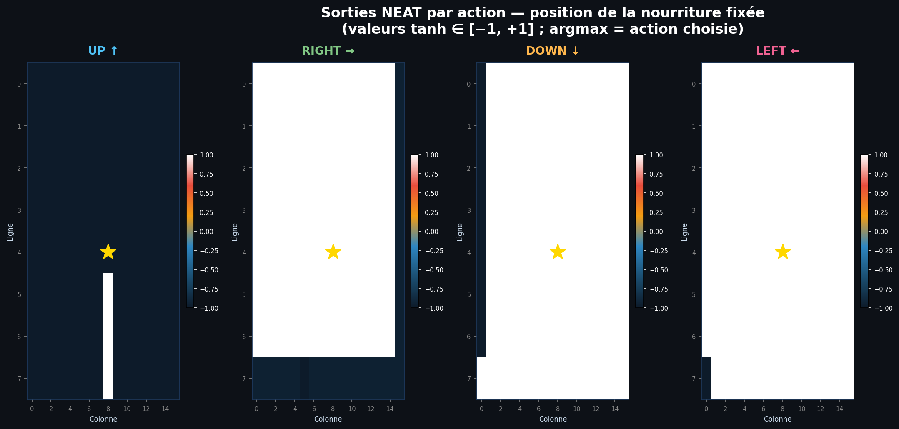

#### Confidence map & learned policy
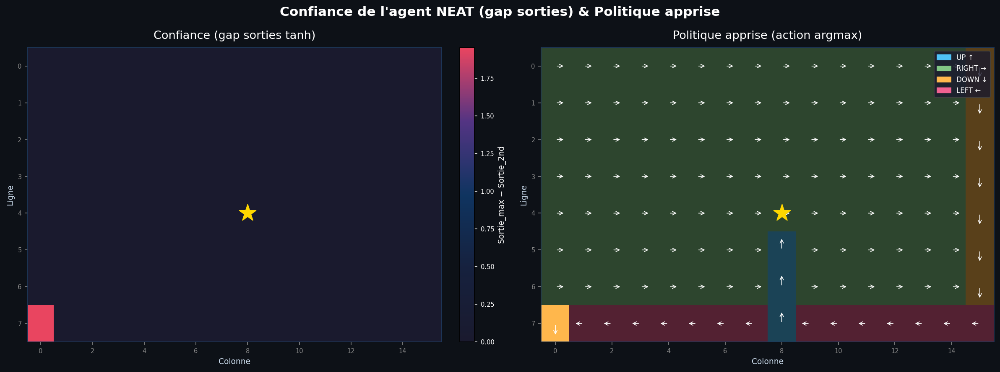

#### Temporal probability evolution
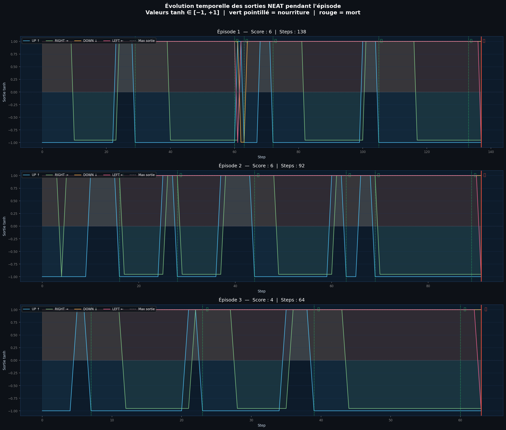

</details>

<details>
<summary>📸 Feature importance — xai_neat_features.py</summary>

Answers the question: **which inputs actually drive the decisions?** Permutation importance measures the score drop when each feature is shuffled. The weight analysis exposes which inputs have the strongest structural connections. The correlation heatmap and sensory profiles show which feature tends to trigger which action.

Key finding: **food distances dominate over wall distances** — `food_N` is the single most determinant feature. One hidden node stays saturated at tanh ≈ +1 across 100% of steps: it behaves as a **learned bias**, not a situational sensor.

#### Permutation importance
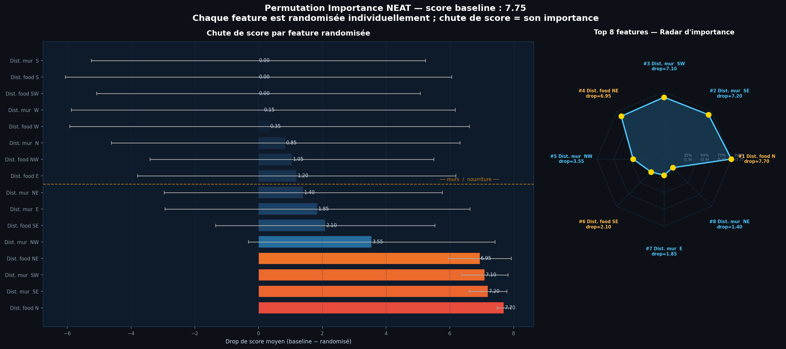

#### Feature-action correlation
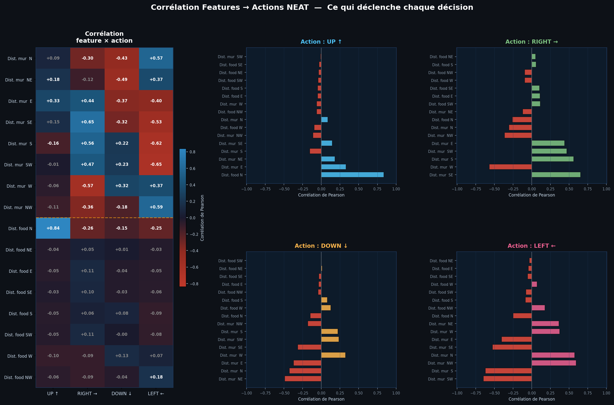

#### Weight analysis (structural connections)
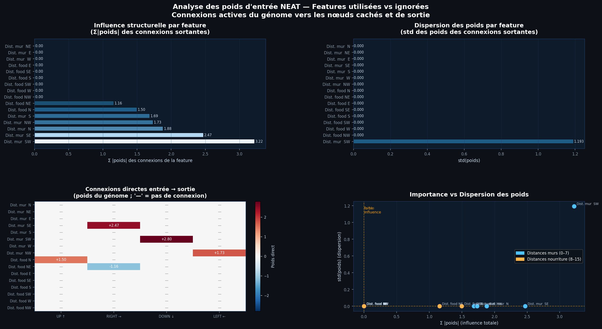

#### Sensory profile per action
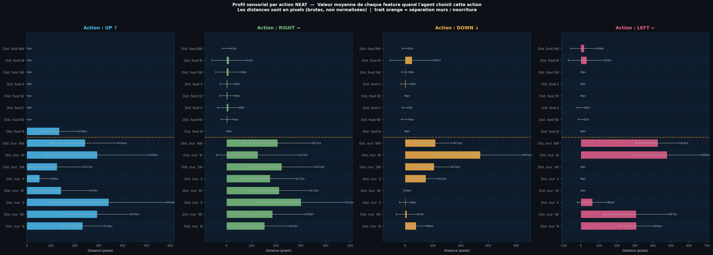

</details>

<details>
<summary>📸 Node activations — xai_neat_activations.py</summary>

Looks inside the hidden layer. The distribution plot identifies active vs. dead neurons (green = active, red = dead — NEAT's parsimony keeps only the useful ones). The specialization plot reveals which nodes fire for specific game situations.

#### Activation distribution (dead vs. active nodes)
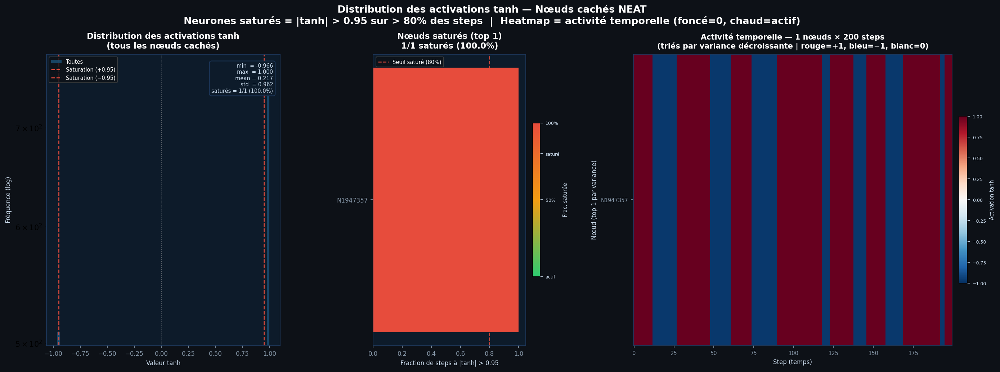

#### Node specialization by game situation
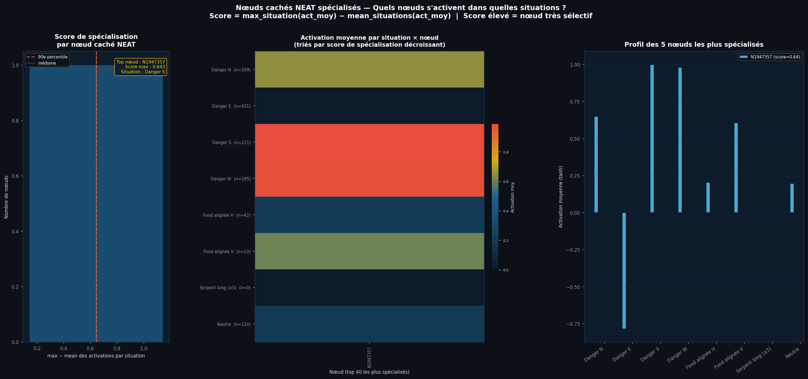

</details>

<details>
<summary>📸 SHAP analysis — xai_neat_shap.py</summary>

Uses **SHAP** to decompose every prediction into per-feature contributions. The beeswarm gives a global ranking of feature impact across all decisions. The waterfall plots break down one specific decision per game situation. The summary heatmap shows signed SHAP values per feature × action, revealing which features push the agent toward or away from each action.

#### Beeswarm plot (global feature impact)
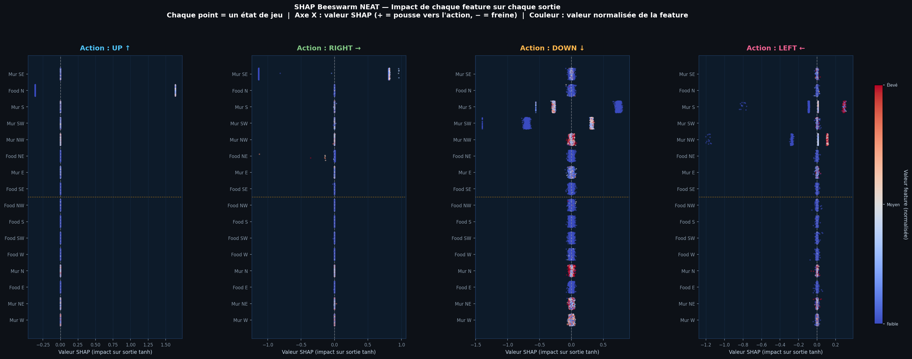

#### Waterfall plots (per game situation)
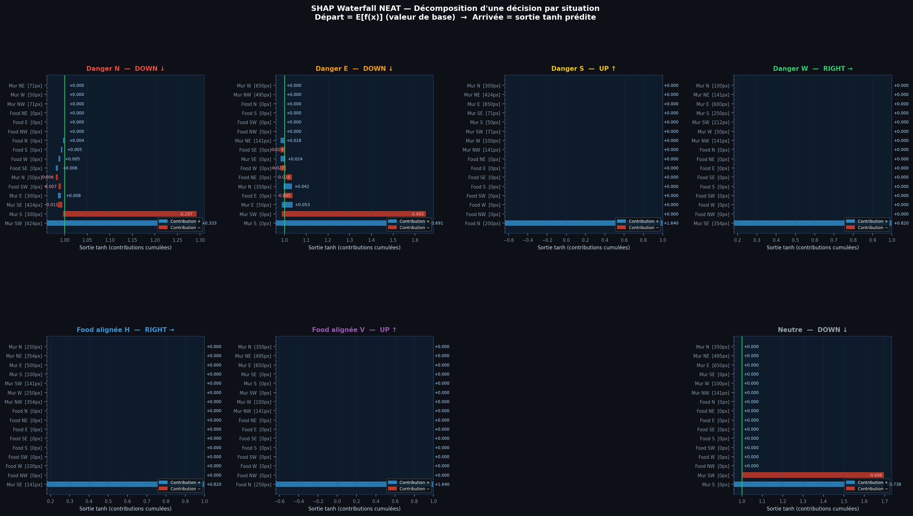

#### SHAP summary heatmap
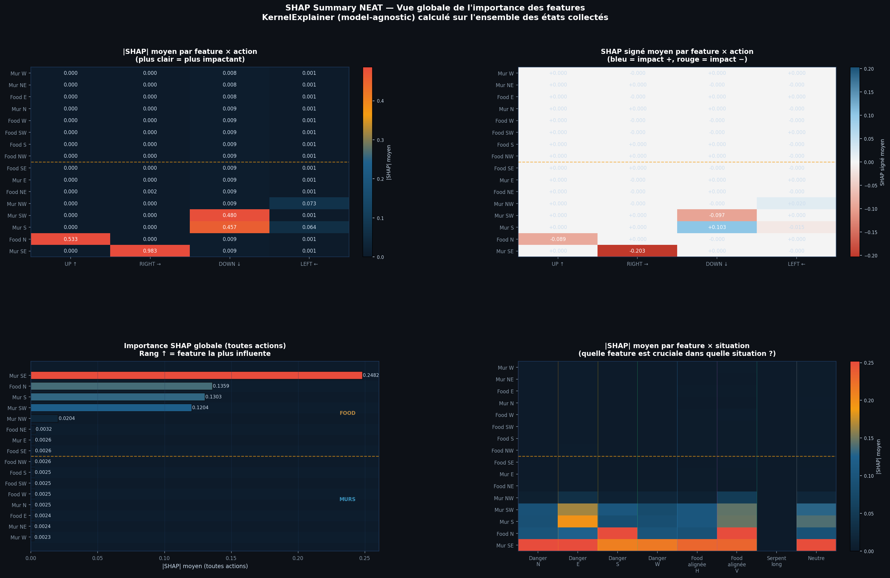

</details>

---

## 💡 Key Insights

**NEAT is the only model in the series readable by hand**
The compact topology — 16 inputs, a handful of evolved hidden nodes, 4 outputs — stays small enough to draw on paper and read directly. The manual strategy extraction confirms what XAI tools later confirm algorithmically: the agent learned a food-attraction circuit with a near-constant bias node. This is the only experiment in the series where manual and algorithmic interpretability produce the same conclusion independently.

**Food-only navigation — no body awareness**
NEAT's 16 inputs encode wall distances and food distances only. There is no information about the snake's own body, no danger binary, no directional encoding. The XAI analysis confirms the agent navigates almost exclusively by food proximity — `food_N` is the dominant feature by a large margin. Wall distances are largely irrelevant: the agent avoids walls as a side effect of staying near food, not by modeling danger directly.

**The learned bias node: a structural artifact with strategic consequences**
One hidden node behaves as a constant — saturated at tanh ≈ +1 across all game states. It contributes a fixed offset to every action decision, effectively acting as a **learned prior**: a default tendency that gets overridden only when food signals are strong enough. This is the kind of low-level structural feature that XAI tools can surface but that would never appear in a verbal description of the strategy.

**The circular strategy: emergent and brittle**
The agent settled on a rotation pattern: when food is detected in a given direction, it curves toward it in a roughly circular arc. This works well in open space — the agent is rarely uncertain about what to do. But it fails catastrophically when the snake's own body lies in the rotation path, which is why mean score plateaus at ~10. The strategy is **emergent** (never programmed), **interpretable** (readable from the graph), and **brittle** (cannot generalize to self-avoidance).

**XAI as a baseline for the whole series**
The tools used here — permutation importance, weight analysis, SHAP, activation profiling — are applied to all 4 agents in this series. NEAT serves as the ground truth: because the manual and algorithmic interpretations agree, we can trust the tools when they reveal things that cannot be verified by hand in the later, larger models.

### Learned strategy comparison across the 4 experiments

| Agent | Strategy type | Most influential feature |
| ----- | ------------- | ------------------------ |
| **NEAT** | **Circular, food-chasing, fixed** | **`food_N` (food distance North)** |
| Decision Tree | Reactive, danger-aware, adaptive | `ΔFood Y` + `Danger E/W` |
| DQL | Size-aware, body-anticipating | `Length` + `ΔFood X/Y` |
| PPO | Symmetric risk, end-game anticipation | `Danger binary` (all directions) |

---

## 🔭 Perspectives

  🗺️ **Saliency Maps** — the natural next step: apply XAI to image recognition models, highlighting the exact pixels that triggered a decision (e.g., a cat's ears to classify it as a cat).

  🤖 **Automated XAI** — move from human-driven data science analysis to an AI that automatically analyzes any model and produces a readable strategy summary. Current tools are fast but shallow; an intelligent XAI system could reveal complex multi-feature interactions that no human would manually uncover.

  🏛️ **Neural network analysis database** — build a dataset of diverse trained agents, then train an AI to generalize: input a model, output its strategy in human-readable form.

  🧹 **Optimization via XAI** — the dead/bias nodes identified from activation profiles could directly guide topology pruning: fewer nodes, same behavior, lower compute cost.

  📐 **Richer input encoding** — the 16-input limitation is the direct cause of NEAT's body-blindness. Adding binary danger inputs (like the Decision Tree's 26-feature state) would give the agent the information it needs to develop a self-avoidance strategy, and could change the emerged behavior entirely.

---

## 📂 Repository structure
```bash
├── Images/                 # Images for the README
│
├── best_model_8.pkl        # Saved model checkpoint
├── best_model_11.pkl       # Saved model checkpoint - the best
│
├── compteur.py             # Counter script
├── compteur_executions.txt # Execution log for the counter
├── config.txt              # Neat configuration file
├── donnees_neat.xlsx       # Training data (Excel) - Graph for score
│
├── exw.py                  # Excel writer script
├── ia.py                   # Main AI logic
├── main.py                 # Project entry point
├── snake.py                # Snake game implementation
│
├── xai_neat_outputs.py     # XAI — Output heatmaps & temporal analysis
├── xai_neat_features.py    # XAI — Feature importance
├── xai_neat_activations.py # XAI — Node activations
├── xai_neat_shap.py        # XAI — SHAP explanations
│
├── xai_neat_outputs/       # Output plots — Predictions
├── xai_neat_features/      # Output plots — Feature importance
├── xai_neat_activations/   # Output plots — Activations
├── xai_neat_shap/          # Output plots + HTML — SHAP
│
├── network_graph/          # Network graph visualization
│   └── network_graph.png
│
├── Rapport MPP - Thibault GAREL - 2026-04-13.pdf   # Full analysis report
├── LICENSE                 # Project license
├── README.md               # Main documentation
```

---

## 💻 Run it on Your PC
Clone the repository and install dependencies:
```bash
git clone https://github.com/Thibault-GAREL/AI_snake_genetic_version.git
cd AI_snake_genetic_version

python -m venv .venv # if you don't have a virtual environment
source .venv/bin/activate   # Linux / macOS
.venv\Scripts\activate      # Windows

pip install neat-python numpy pygame openpyxl
pip install shap            # for xai_neat_shap.py

python main.py
```

### Run XAI analyses

```bash
python xai_neat_outputs.py              # all prediction plots
python xai_neat_features.py             # all feature importance plots
python xai_neat_activations.py          # node activations
python xai_neat_shap.py                 # all SHAP plots
python xai_neat_shap.py --beeswarm      # SHAP beeswarm only
```

---

## 📄 Full Report

A detailed report accompanies this project series, covering the full analysis : NEAT training methodology, manual interpretability, XAI results, and comparison across the 4 Snake AI approaches (NEAT, Decision Tree, DQL, PPO).

📥 [Download the report (PDF)](Rapport%20MPP%20-%20Thibault%20GAREL%20-%202026-04-13.pdf)

---

## 📖 Sources & Research Papers

- **NEAT algorithm** — [*Evolving Neural Networks through Augmenting Topologies*](http://nn.cs.utexas.edu/downloads/papers/stanley.ec02.pdf), Stanley & Miikkulainen (2002)
- **XGBoost** — [*A Scalable Tree Boosting System*](https://arxiv.org/abs/1603.02754), Tianqi Chen (2016)
- **DAgger** — [*A Reduction of Imitation Learning and Structured Prediction to No-Regret Online Learning*](https://arxiv.org/abs/1011.0686), Ross et al. (2011)
- **Deep Q-Learning** — [*A Theoretical Analysis of Deep Q-Learning*](https://arxiv.org/abs/1901.00137), Zhuoran Yang (2019)
- **PPO** — [*Proximal Policy Optimization Algorithms*](https://arxiv.org/abs/1707.06347), John Schulman (2017)
- **XAI Survey** — [*Explainable AI: A Survey of Needs, Techniques, Applications, and Future Direction*](https://arxiv.org/abs/2409.00265), Mersha et al. (2024)
- *L'Intelligence Artificielle pour les développeurs* — Virginie Mathivet (2014)

Code created by me 😎, Thibault GAREL — [GitHub](https://github.com/Thibault-GAREL)
